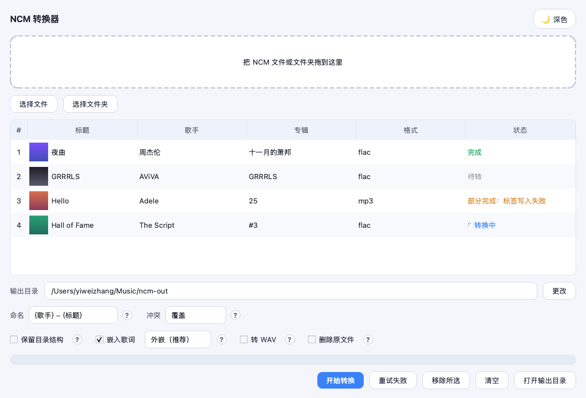

[English](README.md) | **中文**

# NCM 转换器

把网易云音乐下载的 `.ncm` 文件转换为通用播放器可直接播放的音频，并完整保留标题、歌手、专辑、封面等信息。跨平台（macOS / Windows），简约图形界面。

## 特性

- **无损本质**：NCM 只是把原始音频加了层加密壳，并非编码格式。本工具解密后原样写出里面的音频流——FLAC 还是 FLAC，逐比特一致，音质毫无改变。
- **又快又顺**：解密密钥流以 256 字节为周期，故只需预计算一次「密钥垫」，再用向量化的 numpy 异或处理；numpy 计算时会释放 GIL。24bit/192kHz 的曲子约 0.25 秒解密完，同时转换多首大文件时界面依然流畅。
- **保留原始格式优先**：FLAC → FLAC，MP3 → MP3，不重新编码。
- **MP3 / FLAC 直接处理**：已是 `.mp3` 或 `.flac` 的文件不重新编码、原样放入输出；同样可改名、可嵌入歌词、可删除原文件（默认复制，勾选「删除原文件」则移动）。
- **特殊格式安全处理**：全景声 / 杜比等以 `.m4a` 原样导出并标注，绝不强转、绝不产出坏文件。
- **批量与队列管理**：拖入文件或文件夹（递归扫描）、带序号的列表、多线程转换、逐文件进度与动效；可移除选中项（Delete / Backspace）或一键清空。
- **转换前预览**：直接显示标题 / 歌手 / 专辑 / 格式 / 封面缩略图。
- **元数据与封面**：写回 FLAC / MP3；非 RGB 封面会归一化为 RGB，确保播放器能显示。
- **歌词**：源文件旁有同名 `.lrc` 时可加入结果——可选「外嵌」(在输出旁生成 `.lrc`，推荐，兼容性最好) 或「内嵌」(写进音频文件内部)；会清理 NetEase 的 JSON 行、保留时间轴歌词。
- **贴心选项**：命名模板、保留目录结构、冲突策略（覆盖 / 重命名 / 跳过）、可选转 WAV（未装 ffmpeg 时自动置灰）、可选转换后删除原文件（连同同名 `.lrc`，带确认）、深 / 浅主题、失败重试、一键打开输出目录——每个选项旁都有「?」帮助按钮。

## 截图



## 环境与安装

需要 Python 3.9+。

```bash
pip install -r requirements.txt
```

可选：安装 [ffmpeg](https://ffmpeg.org/) 后才能使用「转 WAV」功能；不安装不影响其他功能。

## 运行

```bash
python main.py
```

## 打包

使用 PyInstaller 配合仓库内的配置打包（在 macOS 上构建 `.app`，在 Windows 上构建 `.exe`）：

```bash
pip install -r requirements-dev.txt
pyinstaller build.spec
```

产物在 `dist/` 目录。

PyInstaller 无法跨平台编译，所以 macOS 的 `.app` 必须在 macOS 上构建、Windows 的 `.exe` 必须在 Windows 上构建。若要自动构建，推送一个 `v*` 标签（如 `v1.0.0`）：GitHub Actions 会产出 macOS（Apple 芯片，arm64）和 Windows 两个包并挂到 Release。也可在 Actions 页面手动触发。

关于 Intel Mac：arm64 包只能在 Apple 芯片上运行。GitHub 免费的 Intel macOS runner 稀缺且正在退役，因此 CI 不产出 Intel（x86_64）包。如需 Intel 包，请在一台 Intel Mac 上运行 `pyinstaller build.spec` 自行构建（该包在 Apple 芯片上也可经 Rosetta 运行）。

## 元数据与封面

在输出格式允许的前提下，尽量保留标题、歌手、专辑、封面：

- **FLAC / MP3**：完整写回标题、歌手、专辑和封面。
- **WAV**：WAV 格式本身不支持内嵌封面与标签，转成 WAV 会丢失这些信息。需要完整元数据和封面，请保留原始 FLAC，不要转 WAV。
- **m4a（沉浸声 / 全景声）**：作为特殊格式原样导出，不回写标签与封面。

## 沉浸声 / 全景声（杜比）

网易云的「沉浸声 / 全景声」（杜比）下载文件是 `.m4a`（对象化的空间音频流）。本工具会将其**原样导出**并标注为特殊格式。它**无法转换为 FLAC**：FLAC 是普通 PCM，承载不了对象化的空间音频，强行转换只会降混为立体声、丢失沉浸效果；部分播放器也无法播放这类 `.m4a`。如果你需要 FLAC 输出，不建议添加沉浸声 / 全景声曲目。

## 说明

本工具用于把你自己已下载 / 已购买的音乐转换为通用格式，便于在其他播放器上播放，仅供个人使用。

**本软件不可用于任何商业行为。**
